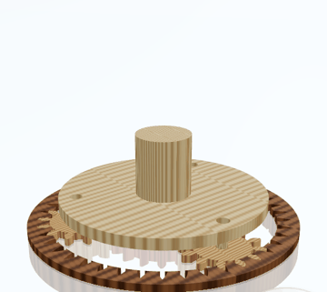

[English](README_EN.md) | 中文

<div align="center">

# build123d-cad — 硬件设计 Super Skill

> *「像机械师思考，而不是像程序员思考。」 — Dave Cowden*

[](LICENSE)
[](https://github.com/obra/superpowers)
[](#不只是-claude-code跨-agent-的-skillmd-标准)
[](https://github.com/gumyr/build123d)
[](https://tscircuit.com)

<br>

**一次安装，25 个子技能。两条主线 — 🛠️ CAD 机械建模 · ⚡ PCB 板级电气 — 端到端打通；
外加网页预览 / 机器人描述 / 动力学仿真 / 制造出工 / 需求合同 / 执行器裕量 / PCB 结构可靠性 / 电路电源热检查 / 步态评分 / 运动控制轨迹 / 固件 dry-run / sim2real 校准 / 集成 bring-up gate / FEA 结构门禁 / 磨损疲劳门禁 / MuJoCo 场景门禁 / 机械狗数字孪生编排。**

<br>



*木纹行星减速器 — **viewer 网页预览**（浏览器，纹理 URDF + 关节联动动画，毫米级真实装配）*

<br>


*直齿轮 — **OCP CAD Viewer 实时预览**（VS Code 内，CAD 建模即时反馈）*

<br>


*壳体爆炸动画 — CAD 装配能力*

<br>

</div>

---

## 这是什么

`build123d-cad` 是一个 **硬件设计 Super Skill**：一个父技能下面挂 25 个子技能（monorepo 模块化）。
一次 `npx skills add` 安装即得全部能力；每个子技能独立 `SKILL.md / references / scripts / tests`，可单独 `pytest` 回归。

父级 `SKILL.md` 只做关键词路由（≤ 220 行），进子技能再读细节——**两层路由**，避免一次性把整套实现塞进上下文。

---

## GitHub 首页速览

如果把本 README 放在 GitHub 仓库首页，访客可以先看这张表快速定位全部内容；如果要做组织首页，也可以把本节复制到
`.github/profile/README.md`。

### 核心仓库入口

| 仓库 | 定位 | Commit 波浪 | 入口 |
|---|---|---|---|
| `build123d-cad` | 硬件设计 Super Skill 主仓库：25 个子技能、路由、协议、脚本与测试 |  | [baibai2013/build123d-cad](https://github.com/baibai2013/build123d-cad) |
| `build123d-cad-skill-test` | CAD / 装配 / viewer / URDF / GLB 动画测试案例集合 |  | [baibai2013/build123d-cad-skill-test](https://github.com/baibai2013/build123d-cad-skill-test) |
| `build123d-parts-lib` | build123d 参数化标准件库：紧固件、轴承、舵机、传动、销、密封等 |  | [baibai2013/build123d-parts-lib](https://github.com/baibai2013/build123d-parts-lib) |

### 全部能力矩阵

| 域 | 子技能 | 解决的问题 |
|---|---|---|
| CAD 建模与装配 | [`mechanical`](skills/mechanical/) · [`parts-catalog`](skills/parts-catalog/) · [`viewer`](skills/viewer/) | 参数化建模、标准件复用、装配、爆炸动画、网页预览、截图自验 |
| 机器人描述 | [`urdf`](skills/urdf/) · [`srdf`](skills/srdf/) · [`sdf`](skills/sdf/) | URDF / SRDF / SDF 导出、关节、规划组、Gazebo 世界 |
| 制造出工 | [`gcode`](skills/gcode/) · [`sendcutsend`](skills/sendcutsend/) · [`bambu-labs`](skills/bambu-labs/) | FDM 切片预检、激光切割报价、Bambu 上传打印 |
| PCB 与电子 | [`pcb`](skills/pcb/) · [`electronics-bom`](skills/electronics-bom/) · [`circuit-simulation`](skills/circuit-simulation/) · [`pcb-mechanical-reliability`](skills/pcb-mechanical-reliability/) | tscircuit 造板、BOM、Gerber/BOM/CPL、嘉立创报价、电源预算、PCB 装配可靠性 |
| 虚拟验证 | [`requirements-verification`](skills/requirements-verification/) · [`actuator-sizing`](skills/actuator-sizing/) · [`fea`](skills/fea/) · [`wear-fatigue`](skills/wear-fatigue/) | 需求合同、验证矩阵、执行器裕量、结构强度、磨损疲劳、维护周期 |
| 运动与仿真 | [`simulation`](skills/simulation/) · [`mujoco-simulation`](skills/mujoco-simulation/) · [`gait-optimization`](skills/gait-optimization/) · [`motion-control`](skills/motion-control/) | PyBullet / MuJoCo 场景门禁、步态评分、IK/FK、轨迹与控制参数 |
| 实体前闭环 | [`firmware`](skills/firmware/) · [`sim2real-calibration`](skills/sim2real-calibration/) · [`integration`](skills/integration/) · [`robot-dog-digital-twin`](skills/robot-dog-digital-twin/) | 固件 dry-run、仿真实机校准、bring-up/HIL gate、机械狗数字孪生总控 |

> GitHub 原生 pinned repositories 最多只能展示 6 个，且不能手动控制右侧 activity sparkline；这里用 README 内嵌 SVG 模拟 pin 卡片里的 commit 波浪。

---

## 🚩 两条主线：CAD 与 PCB

这套技能围绕硬件研发的两个核心域构建，**机械（CAD）** 与 **电气（PCB）** 各成闭环、又能互相 handoff。

### 🛠️ CAD — 机械建模全栈（`mechanical`）

用 **build123d**（Python 代码即 CAD）做参数化建模，不靠鼠标拉草图：

- **参数化建模 → 装配 → 爆炸动画 → 仿真预检**，全程代码可复现、可 diff、可回归。
- **双预览**：VS Code 内 *OCP CAD Viewer* 实时反馈；浏览器 *viewer* 多引擎截图自验（headless，可进 CI）。
- **标准件库**：本地 `build123d-parts-lib` 收录 **8 类 66 种** 参数化标准件（紧固件 21 · 作动器 19 · 传动 9 · 轴承 7 · 销 4 · 舵机 3 · 挡圈 2 · 密封 1），另接 McMaster-Carr / GrabCAD / TraceParts 在线源。
- **出工闭环**：导 STEP/DXF → 3D 打印切片预检（`gcode`）/ 激光切割报价（`sendcutsend`）/ Bambu 上传（`bambu-labs`）。
- **机器人描述**：build123d → URDF（每 link 纹理 GLB、米制单位、关节可动）+ MoveIt 规划组（`srdf`）+ Gazebo 世界（`sdf`）。

```
> 帮我建一个法兰盘，6 个螺栓孔均匀分布，导成 STEP 在浏览器里看
> 这个支架激光切多少钱
> 把这台机器人导成 URDF + 加载到 pybullet 看看关节
```

### ⚡ PCB — 代码即电路，端到端造板（`pcb`）

用 **tscircuit**（React/TypeScript 写电路）一把 `tsci` CLI 打通 **authoring → check/DRC → web 预览 → 出件 → 嘉立创下单**：

- **写 TSX 即电路**：`<board>` 里放元件 + 布局 props + `<trace>` 连线，参数（尺寸/电压）定义在顶部。
- **check 才算数**：`tsci build` 跑 DRC + 本地 DFM 比对嘉立创工艺，不靠肉眼。
- **三路 3D/2D 预览**：`tsci dev`（PCB+原理图+3D）/ snapshot 出 PNG·SVG / 导 GLB 进 viewer 统一预览。
- **一键出件**：Gerber / BOM / CPL / STEP / GLB 全套，从 `circuit.json` 派生（build 已自动配嘉立创料号）。
- **嘉立创（JLCPCB）报价 + 下单**：经 `jlcpcb-mcp` 免 key 查料/报价 + 需 key 板级报价；**真实下单是 gate，必须 `--confirm`**，无 key 降级开网页、绝不假装成功。

```tsx
// index.circuit.tsx — 一个会亮的 LED 板
export default () => (
  <board width="20mm" height="15mm">
    <led name="LED1" footprint="0603" pcbX={-3} schX={-2} />
    <resistor name="R1" resistance="330" footprint="0402" pcbX={3} schX={2} />
    <trace from="net.VCC" to=".R1 > .pin1" />
    <trace from=".R1 > .pin2" to=".LED1 > .anode" />
    <trace from=".LED1 > .cathode" to="net.GND" />
  </board>
)
```

```
> 用代码写块 LED 板，0603 封装，发嘉立创报个价
> 这块板出 Gerber + BOM + CPL，顺便给我看下 3D
```

> **CAD ↔ PCB handoff**：pcb 导 `.step` + 板框 `.dxf` → mechanical 读做外壳让位/装配间隙；
> 二者在 viewer 里可双引擎并显。「PCB 外壳一起做」是这套技能的典型联动场景。

---

## 不只是 Claude Code：跨 Agent 的 SKILL.md 标准

本仓库遵循开放的 **Agent Skills（`SKILL.md`）格式**——纯文件式技能（`SKILL.md` + `references/` + `scripts/`），
**不绑定任何单一 Agent 运行时**。任何支持 Agent Skills 约定的编码 Agent 都能加载并执行：

| Agent / 运行时 | 怎么用 |
|---|---|
| **Claude Code**（CLI / 桌面 / IDE 扩展） | `npx skills add baibai2013/build123d-cad`，关键词自动路由子技能 |
| **Cursor / Windsurd 等支持 skills 的 IDE** | 同一份 `SKILL.md` 直接挂载，无需改写 |
| **自建 Agent / LangGraph / 自研 harness** | 把 `skills/<name>/SKILL.md` 作为上下文注入 + `scripts/` 当工具调用 |
| **纯命令行 / CI** | `scripts/*.sh|*.py` 全部 fail-loud、可独立跑，不依赖 LLM 也能出件 |

之所以能跨 Agent，是因为我们守住了几条工程红线：

- **能力即文件**：每个子技能 = `SKILL.md`（给 Agent 读）+ `scripts/`（确定性执行）+ `references/`（查询表）+ `tests/`（回归）。Agent 只是“读说明书 + 调脚本”的人，换个 Agent 不影响。
- **脚本自治、fail-loud**：`scripts/` 不假设有 LLM 在场，缺工具直接报安装提示退出（如 `tsci`/`bun` 缺失），可在裸 CI 里跑。
- **文件接口跨技能**：子技能之间不互调函数、不互引 references，一律走 `shared/` 约定的输出文件路径（如 `output/<task>/electrical/<board>.circuit.json`）。换 Agent、换语言都不破。

> 一句话：**Claude Code 是首选驱动，但技能本身是 Agent-agnostic 的资产。**

---

## 子技能集合（25 个）

| 子技能 | 一句话定位 | 路径 | 优先级 |
|---|---|---|---|
| 🛠️ **mechanical**  | build123d Python CAD 全栈：参数化建模 / 装配 / 爆炸动画 / 仿真 / Playbook 方法论 | [skills/mechanical](skills/mechanical/) | P0 根基 |
| ⚡ **pcb**          | tscircuit 端到端造板：写 TSX → check/DRC → web 预览 → 出件(Gerber/BOM/CPL) → 嘉立创报价/下单 | [skills/pcb](skills/pcb/) | **P1 ✅** |
| 🌐 **viewer**       | 网页多引擎预览容器（CAD / PCB / 原理图 / tscircuit），headless 截图；URDF 每 link GLB 纹理渲染（关节可动、米制单位） | [skills/viewer](skills/viewer/) | P0 |
| **urdf**           | build123d → URDF 自动导出（link/joint/mesh）+ pybullet 加载 + 纹理 URDF 工作流（木纹/贴图 + 渲染自验） | [skills/urdf](skills/urdf/) | P0 |
| **parts-catalog**  | 找现成标准件：本地 **build123d-parts-lib（8 类 66 种参数化标件）** + McMaster / GrabCAD / TraceParts 在线源 | [skills/parts-catalog](skills/parts-catalog/) | P0 |
| **srdf**           | MoveIt 规划组 + 自碰撞矩阵生成 | [skills/srdf](skills/srdf/) | P1 |
| **sdf**            | Gazebo 仿真世界（SDF 格式） | [skills/sdf](skills/sdf/) | P1 |
| 🤖 **simulation**  | 无头动力学仿真：URDF/SDF 丢进 pybullet（`p.DIRECT`）跑 跌落/站立/步态 → 自验稳定性（没穿地/没爆炸/关节限位/没翻）+ 离屏渲染截图，可进 CI | [skills/simulation](skills/simulation/) | **P1 ✅** |
| **gcode**          | FDM 切片预检（壁厚 / 悬臂 / 打印估时） | [skills/gcode](skills/gcode/) | P1 |
| **sendcutsend**    | 激光切割预检 + DXF 报价 + kerf 补偿 | [skills/sendcutsend](skills/sendcutsend/) | P1 |
| **bambu-labs**     | Bambu 打印机上传作业 / AMS 多色 | [skills/bambu-labs](skills/bambu-labs/) | P2 |
| electronics-bom | 电子 BOM 与机器人常用料选型：离线 curated catalog 选择 MCU/电机驱动/编码器/电源/连接器 → 输出 `electronics_bom.json` / `selected_parts.json` | [skills/electronics-bom](skills/electronics-bom/) | **P1 ✅ BOM** |
| requirements-verification | 需求合同与验证矩阵：产 `requirements.yaml` / `verification_matrix.yaml` / gate 阈值 / risk register | [skills/requirements-verification](skills/requirements-verification/) | **P0 ✅ 合同** |
| actuator-sizing | 机械狗执行器早期校核：读取需求/架构 → 估算 hip/knee/ankle 扭矩、速度、热裕量 → 输出 `actuator_spec.yaml` / `torque_margin.json` | [skills/actuator-sizing](skills/actuator-sizing/) | **P0 ✅ 执行器** |
| pcb-mechanical-reliability | PCB 结构可靠性早期校核：检查板厚/挠曲/支撑柱/连接器/线束/装配间隙 → 输出 `pcb_fit.json` / `pcb_reliability_report.json` | [skills/pcb-mechanical-reliability](skills/pcb-mechanical-reliability/) | **P0 ✅ PCB 结构** |
| circuit-simulation | 电路与电源热早期校核：检查 ERC/DRC、电源预算、电机驱动电流、保护、热风险 → 输出 `circuit_check.json` / `power_budget.json` / `thermal_report.json` | [skills/circuit-simulation](skills/circuit-simulation/) | **P0 ✅ 电路** |
| gait-optimization | 步态合理性早期校核：检查 IK/相位/站立/慢走/roll/pitch/打滑/扭矩/能耗 → 输出 `gait_score.json` / `best_gait_params.yaml` | [skills/gait-optimization](skills/gait-optimization/) | **P0 ✅ 步态** |
| motion-control | 运动控制轨迹 MVP：检查二维腿 IK、生成 trot/walk/bound 相位轨迹和控制参数 → 输出 `trajectory.json` / `controller_params.yaml` / `ik_report.json` | [skills/motion-control](skills/motion-control/) | **P1 ✅ 控制** |
| firmware | 固件 dry-run MVP：检查 MCU/控制环/CAN/安全/校准合同，生成 manifest/CAN 帧/校准报告，不烧录不上电 | [skills/firmware](skills/firmware/) | **P2 ✅ dry-run** |
| sim2real-calibration | 仿真到实机校准 MVP：比较仿真/实机速度、打滑、扭矩、姿态、延迟误差 → 输出 `sim2real_calibration.json` / `parameter_update.yaml` | [skills/sim2real-calibration](skills/sim2real-calibration/) | **P2 ✅ 校准** |
| integration | 整机集成 dry-run MVP：检查数字孪生/制造/固件/安全/人工批准/HIL/数据采集 gate → 输出 `integration_checklist.json` / `hil_plan.md` | [skills/integration](skills/integration/) | **P2 ✅ dry-run** |
| fea | 结构 FEA 早期门禁：检查应力、安全系数、变形、模态和跌落风险 → 输出 `fea_report.json` / `static_case_report.json` | [skills/fea](skills/fea/) | **P1 ✅ 结构** |
| wear-fatigue | 磨损疲劳早期门禁：检查齿轮/轴承/足垫/关节限位/线束/连接器寿命风险 → 输出 `wear_report.json` / `fatigue_report.json` / `maintenance_interval.md` | [skills/wear-fatigue](skills/wear-fatigue/) | **P1 ✅ 寿命** |
| mujoco-simulation | MuJoCo 场景门禁：检查 stand/walk/slope/drop/push 的稳定性、接触、打滑、扭矩和能耗 → 输出 `mujoco_result.json` / `*.sim_result.json` | [skills/mujoco-simulation](skills/mujoco-simulation/) | **P1 ✅ MuJoCo** |
| robot-dog-digital-twin | 机械狗数字孪生编排：收集多域 artifact → gate → design_score → failure_report → 下一轮参数建议 | [skills/robot-dog-digital-twin](skills/robot-dog-digital-twin/) | **P0 ✅ 编排** |

---

## 安装

```bash
npx skills add baibai2013/build123d-cad
```

依赖（按用到的子技能挑装）：

```bash
# 🛠️ CAD：mechanical / urdf 必备
pip install build123d ocp-vscode
code --install-extension bernhard-42.ocp-cad-viewer

# ⚡ PCB：pcb 子技能（tscircuit 依赖 bun 运行时）
bun add -g tscircuit                  # 提供 tsci CLI
claude mcp add jlcpcb -- npx -y jlcpcb-mcp@0.3.3   # 嘉立创报价/下单(可选)

# 🌐 viewer：直跑 server.mjs，不用 npm install
node --version

# urdf 加 pybullet 加载验证
pip install pybullet numpy
```

---

## 用法（Agent 内）

父 `SKILL.md` 按关键词路由到子技能，进入子技能后再读细节：

```
> 帮我建一个法兰盘，6 个螺栓孔均匀分布          # → mechanical (CAD)
> 用代码写块 LED 板并发嘉立创报价               # → pcb (tscircuit 端到端)
> 把这个 STEP / circuit.json 在浏览器里打开看看  # → viewer
> 把这台机器人导成 URDF + 加载到 pybullet        # → urdf, viewer
> 这个支架激光切多少钱                            # → mechanical → sendcutsend
> PCB 外壳一起做                                  # → pcb(电气) + mechanical(外壳) + viewer(双引擎)
> 给机械狗生成需求合同和验证矩阵                    # → requirements-verification
> 这套机械狗电机和减速器扭矩够不够                  # → actuator-sizing
> 这块 PCB 在机身里支撑和连接器空间合理吗           # → pcb-mechanical-reliability
> 给机械狗选 MCU、电机驱动、编码器和电源 BOM         # → electronics-bom
> 这套电路的电源预算、保护和热风险合理吗            # → circuit-simulation
> 这个机械狗步态会不会摔，下一版参数怎么改          # → gait-optimization
> 生成机械狗 IK 解和 trot 轨迹给仿真                # → motion-control
> 给机械狗固件规划 CAN 帧、急停和校准 dry-run       # → firmware
> 对比仿真和实机日志并给参数校准建议                # → sim2real-calibration
> 检查实体样机首次上电和 HIL bring-up 是否允许      # → integration
> 这条腿强度够吗，变形会不会太大                  # → fea
> 这些齿轮、轴承、足垫和线束多久会磨坏             # → wear-fatigue
> 用 MuJoCo 跑斜坡、台阶、推扰和接触摩擦场景       # → mujoco-simulation
> 这个机械狗虚拟样机能不能进入实体样机            # → robot-dog-digital-twin(gate + score)
```

---

## 架构原则（5 条）

1. **两层路由**：父 SKILL 只列关键词表（≤ 220 行）；进子技能再读详细 references。父级不展开实现。
2. **子技能自治**：每个子技能必须有 `SKILL.md + README.md`，外加 `references/ scripts/ tests/` 至少一项。
3. **零互引用**：子技能之间不直接引用彼此的 references；跨技能调用一律走 `shared/` 协议（CI grep 红线）。
4. **文件标准接口**：子技能间不做函数调用，通过约定的输出文件路径交换（如 `output/<task>/<part>.step`）。
5. **可独立测试**：`cd skills/<name> && pytest tests/` 秒级反馈；父级 `tests/` 只测跨子技能流程。

---

## 仓库结构

```
build123d-cad/
├── SKILL.md                          # 父级路由（≤ 220 行）：关键词 → 子技能
├── README.md                         # 本文件（开发者视角）
├── skills/                           # 子技能集合（25 个），每个可独立 pytest
│   ├── mechanical/                   #   🛠️ build123d 建模 / 装配 / 仿真 / Playbook
│   ├── pcb/                          #   ⚡ tscircuit 端到端造板（legacy-kicad/ 为归档旧路线）
│   ├── viewer/                       #   网页多引擎预览
│   │   └── scripts/engines/{cad,pcb,sch,sim,tscircuit}/
│   ├── urdf/  srdf/  sdf/            #   机器人描述
│   ├── simulation/                   #   🤖 无头 pybullet 动力学仿真 + 稳定性自验
│   ├── gcode/  sendcutsend/  bambu-labs/  parts-catalog/   # 制造出工
│   ├── electronics-bom/              #   电子 BOM / curated catalog / 选型报告
│   ├── requirements-verification/    #   需求合同 / 验证矩阵 / risk register
│   ├── actuator-sizing/              #   执行器扭矩 / 速度 / 热裕量早期 gate
│   ├── pcb-mechanical-reliability/   #   PCB 刚度 / 支撑柱 / 连接器 / 装配间隙 gate
│   ├── circuit-simulation/           #   电源预算 / 保护 / 电流 / 热风险 gate
│   ├── gait-optimization/            #   步态评分 / 参数建议 / gait gate
│   ├── motion-control/               #   IK / gait trajectory / controller params
│   ├── firmware/                     #   固件 dry-run / CAN / calibration / safety gate
│   ├── sim2real-calibration/         #   仿真-实机误差 / 参数校准
│   ├── integration/                  #   bring-up / HIL / first-power gate
│   ├── fea/                          #   结构强度 / 刚度 / 模态 / FEA gate
│   ├── wear-fatigue/                 #   磨损 / 疲劳 / 维护周期 gate
│   ├── mujoco-simulation/            #   MuJoCo / MJCF / 高保真场景 gate
│   └── robot-dog-digital-twin/       #   机械狗数字孪生 gate / score / failure report
├── shared/                           # 跨子技能协议
│   ├── handoff-protocols.md          #   文件接口 + 路径约定
│   ├── multi-skill-router.md         #   关键词 → 子技能权威映射
│   └── dependencies.md               #   依赖图与被依赖度
├── tests/                            # 父级跨子技能集成测试
└── docs/                             # 架构与扩展指南
    ├── architecture.md
    ├── adding-new-subskill.md        #   加新子技能 9 步
    ├── pcb-tscircuit-workflow.md     #   PCB 端到端完整闭环
    └── pcb-tscircuit-dev-plan.md
```

---

## 加一个新子技能

未来扩固件 / 仿真 / 其他域，流程固定（详见 [`docs/adding-new-subskill.md`](docs/adding-new-subskill.md)）：

```bash
mkdir -p skills/<name>/{references,scripts,tests}
touch skills/<name>/{SKILL.md,README.md} skills/<name>/tests/conftest.py
```

然后改 3 处共享配置：父 `SKILL.md` 路由表 / `shared/multi-skill-router.md` 关键词表 /
`shared/dependencies.md` 上下游依赖。

---

## 进度与路线

| 阶段 | 范围 | 状态 |
|---|---|---|
| P0 | 骨架 + mechanical 迁移 + viewer/urdf/parts-catalog 复刻 + tests 骨架 | ✅ 已落地 |
| P1 | srdf/sdf/gcode/sendcutsend + **pcb（tscircuit 端到端造板）** | ✅ pcb 已打通 authoring→出件→嘉立创 |
| P2 | bambu-labs / Playbook 治理 / AIGC case 沉淀 | 进行中 |
| 🤖 **仿真（simulation）** | **把"生成机器人描述"升级为"真正跑动力学仿真"**：URDF/SDF 丢进 pybullet headless 跑 跌落/站立/步态，predict-and-verify 闭环（没穿地 / 没爆炸 / 关节限位 / 没翻），离屏渲染截图进 CI | ✅ MVP 已落地（pybullet headless） |
| **下一步 🎯 仿真深化** | MuJoCo / Gazebo 真跑接入 · viewer `engine=sim` 回放（plotly 曲线 + 视频）· 完整 Bézier+IK 步态 + golden-diff 回归 | 🚧 排期中 |
| P3 | electronics-bom（curated 料库喂 pcb 的 tsci import） | 待 Gate |

> **为什么是仿真**：CAD 把"画对"闭环了，PCB 把"造得出 + 发得了"闭环了，
> 但机器人/机构"动起来对不对"此前只停在描述层（URDF/SDF 生成）。`simulation` 子技能把仿真器接成
> 一等公民——和 viewer 一样 headless、可截图、可回归——让"设计 → 仿真验证"成为默认动作，而不是人工另开工具。
> MVP（pybullet headless 跌落/站立/步态 + 稳定性自验）已落地；下一步把 MuJoCo/Gazebo 真跑与 viewer 回放接上。

---

## 这个 Skill 是怎么造出来的

子技能 mechanical 由 [女娲.skill](https://github.com/alchaincyf/nuwa-skill) 辅助生成；super skill 化改造（本仓库当前形态）由仿生机器人公司 tech_lead 牵头。

想蒸馏其他领域的专家 Skill：

```bash
npx skills add alchaincyf/nuwa-skill
```

---

## 免责声明

本项目以工程探索与学习交流为目的。AI 辅助生成的设计建议须结合专业工具评审，实际制造公差请根据工艺自行调整。
**真实下单/付款（PCB 打板等）一律需要显式确认（`--confirm`），无凭据时降级到官方网页，绝不假装成功。**
上游依赖库（build123d / tscircuit / jlcpcb-mcp）持续演进，部分示例代码可能需要适配。

---

## 许可证

Apache License 2.0 — 详见 [LICENSE](LICENSE)。

与上游 [build123d](https://github.com/gumyr/build123d)（Apache 2.0）保持一致。

---

<div align="center">

*像机械师思考，而不是像程序员思考。*

<br>

Apache License 2.0 · Made with [女娲.skill](https://github.com/alchaincyf/nuwa-skill)

</div>
