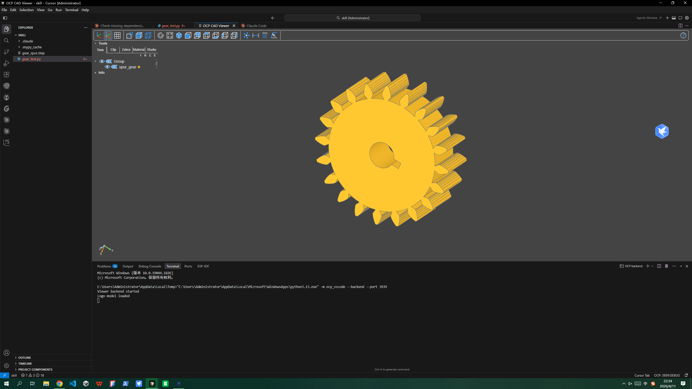

English | [中文](README.md)

<div align="center">

# build123d-cad.skill

> *"Think like a machinist, not a programmer." — Dave Cowden*

[](LICENSE)
[](https://claude.ai/code)
[](https://github.com/gumyr/build123d)
[](https://github.com/alchaincyf/nuwa-skill)

<br>

**Natural Language → Parametric CAD Code → Industrial-Grade STEP Files. One sentence, one part.**

<br>



<br>

Built on CadQuery founder Dave Cowden's modeling philosophy,<br>
with full build123d API coverage, 12 real-world part examples, and 11 typical modeling patterns.<br>
Distilled into 5 core mental models, 8 code quality heuristics, and a complete CAD code generation workflow.

[Examples](#examples) · [Installation](#installation) · [What's Included](#whats-included) · [Part Gallery](#part-gallery)

</div>

---

## Examples

### Prompt: Make a 100x80x50 mounting plate with M5 bolt holes at four corners

```python
# === Parameters ===
plate_l, plate_w, plate_h = 100, 80, 10
hole_r = 2.5          # M5 through hole
margin = 10           # hole offset from edge

# === Modeling ===
with BuildPart() as plate:
    Box(plate_l, plate_w, plate_h)
    with GridLocations(plate_l - 2*margin, plate_w - 2*margin, 2, 2):
        Hole(radius=hole_r)
    top = plate.faces().sort_by(Axis.Z)[-1]
    fillet(top.edges(), radius=3)

# === Export ===
export_step(plate.part, "mounting_plate.step")
```

### Prompt: Make a heat sink with 8 fins on a base plate

```python
# === Parameters ===
base_l, base_w, base_h = 80, 60, 5
fin_h, fin_t = 25, 1.5
fin_count = 8

# === Modeling ===
with BuildPart() as heatsink:
    Box(base_l, base_w, base_h)                    # base plate
    with BuildSketch(heatsink.faces().sort_by(Axis.Z)[-1]):
        with GridLocations(0, base_w / (fin_count + 1), 1, fin_count):
            Rectangle(base_l - 4, fin_t)
    extrude(amount=fin_h)                          # extrude fins

export_step(heatsink.part, "heat_sink.step")
```

### Prompt: I need a 90-degree pipe elbow

```python
# === Parameters ===
outer_r, wall_t = 15, 2
bend_r = 40

# === Modeling ===
path = Edge.make_circle(bend_r, start_angle=0, end_angle=90)
with BuildPart() as elbow:
    with BuildSketch(Plane(path @ 0, z_dir=path % 0)):
        Circle(outer_r)
        Circle(outer_r - wall_t, mode=Mode.SUBTRACT)
    sweep(path=path)

export_step(elbow.part, "pipe_elbow.step")
```

> All 12 runnable examples are in the [`assets/`](assets/) directory, covering mounting plates, flanges, brackets, enclosures, stepped shafts, gears, hinges, and more.

This is not template-based code completion. Every piece of code applies Dave Cowden's modeling philosophy — "operation sequence thinking," "design intent first," "selectors over coordinates," "STEP first." It doesn't stitch APIs together; it models parts through a machinist's cognitive framework.

---

## Installation

```bash
npx skills add baibai2013/build123d-cad
```

Then in Claude Code:

```
> Build a flange with 6 evenly spaced bolt holes
> Make a PCB standoff with M3 threaded hole
> Generate a thin-wall enclosure, 2mm wall thickness
> Make a stepped shaft with a keyway
```

### Prerequisites

```bash
pip install build123d            # CAD kernel
pip install ocp-vscode           # VS Code 3D preview
code --install-extension bernhard-42.ocp-cad-viewer  # VS Code CAD viewer extension
```

---

## What's Included

### 5 Mental Models (from Dave Cowden's Modeling Philosophy)

| Model | One-liner | Source |
|-------|-----------|--------|
| **Operation Sequence Thinking** | CAD code describes machining steps (pick face → sketch → extrude), not coordinate math | CadQuery design philosophy |
| **Design Intent First** | Use `sort_by`/`filter_by` to capture "why it's here," not hard-code "where it is" | CadQuery selector system |
| **Python Ecosystem as Superpower** | Parts are Python objects — loops, functions, parametrics come free | CadQuery design philosophy |
| **Working > Pretty** | Running prototype code > elegant but broken code; ship the part first | Engineering practice |
| **STEP First** | STEP is the universal language of CAD; STL is only for 3D printing | Industry standard |

### 8 Code Quality Heuristics

1. **"Can you describe this to a machinist?"** — If you can't explain it clearly, the code has a problem
2. **"Does it still work if you change one dimension?"** — If not, you've hard-coded coordinates
3. **"Selector or coordinate?"** — Use `.sort_by()` wherever possible, never raw numbers
4. **"Is there a cleaner way?"** — Builder Mode context > intermediate variables
5. **"STEP or STL?"** — CNC/assembly always gets STEP
6. **"Working beats pretty"** — Ship the part first, optimize code later
7. **"Fewer lines = better design"** — Code volume is an inverse quality indicator
8. **"'Not yet' instead of 'impossible'"** — State the limitation, give a time estimate

### 11 Modeling Patterns

| Pattern | Typical Parts |
|---------|---------------|
| Flat plate + hole array | Mounting plates, panels |
| Revolution + polar array | Flanges, gears |
| Extrude + boolean subtract | Brackets, enclosures |
| Thin-wall shell | Boxes, housings |
| Stepped revolution + slot cut | Shafts, pins |
| Cylinder + thread/step | Standoffs, studs |
| Path sweep | Pipe elbows, rails |
| Multi-section loft | Transitional shapes |
| Root solid + per-feature fusion | Gears (complex polygons) |
| Hinge / multi-body | Assembly parts |
| Countersink / counterbore | Fastener mounting plates |

---

## Part Gallery

The `assets/` directory contains 12 ready-to-run parts, from beginner to advanced:

| # | Part | Difficulty | Key Techniques |
|---|------|-----------|----------------|
| 01 | [Mounting Plate](assets/01_mounting_plate.py) | ★ | Box + GridLocations + Hole |
| 02 | [Flange](assets/02_flange.py) | ★★ | Cylinder + PolarLocations |
| 03 | [L-Bracket](assets/03_l_bracket.py) | ★★ | Multi-extrude + Fillet |
| 04 | [Enclosure](assets/04_enclosure.py) | ★★★ | Shell + wall thickness |
| 05 | [Stepped Shaft](assets/05_shaft.py) | ★★★ | Revolve + keyway cut |
| 06 | [PCB Standoff](assets/06_pcb_standoff.py) | ★★ | Concentric cylinders |
| 07 | [Pipe Elbow](assets/07_pipe_elbow.py) | ★★★ | Sweep + hollow section |
| 08 | [Spur Gear](assets/08_gear_spur_v2.py) | ★★★★★ | Root cylinder + per-tooth fusion |
| 09 | [Hinge](assets/09_hinge.py) | ★★★★ | Multi-body assembly |
| 10 | [Heat Sink](assets/10_heat_sink.py) | ★★★ | GridLocations + fin extrude |
| 11 | [Countersunk Plate](assets/11_countersunk_plate.py) | ★★ | CounterSinkHole |
| 12 | [Snap-Fit Clip](assets/12_snap_fit_clip.py) | ★★★★ | Complex profile extrude |

---

## Utility Scripts

The `scripts/` directory contains 4 utility tools:

| Script | Function |
|--------|----------|
| [`validate_part.py`](scripts/validate_part.py) | BRep validation, volume/bounding box checks |
| [`batch_export.py`](scripts/batch_export.py) | Batch export all parts (multi-format) |
| [`extract_params.py`](scripts/extract_params.py) | Extract parametric variables from scripts |
| [`step_info.py`](scripts/step_info.py) | STEP file metadata inspection |

---

## Repository Structure

```
build123d-cad/
├── README.md                             # Chinese README
├── README_EN.md                          # English README
├── SKILL.md                              # Core skill definition (installable)
├── references/
│   ├── cheatsheet.md                     # API quick reference
│   ├── patterns.md                       # 11 modeling pattern templates
│   └── cadcodeverify.md                  # CADCodeVerify integration guide
├── assets/                               # 12 runnable examples (★ ~ ★★★★★)
│   ├── 01_mounting_plate.py
│   ├── 02_flange.py
│   ├── ...
│   └── 12_snap_fit_clip.py
└── scripts/                              # 4 utility scripts
    ├── validate_part.py
    ├── batch_export.py
    ├── extract_params.py
    └── step_info.py
```

---

## How This Skill Was Built

Generated with assistance from [Nuwa.skill](https://github.com/alchaincyf/nuwa-skill).

Nuwa's workflow: input a name → multi-agent parallel research → cross-validate and distill mental models → build SKILL.md → quality verification.

Want to distill other domain expert skills? Install Nuwa:

```bash
npx skills add alchaincyf/nuwa-skill
```

---

## License

MIT — Use it, modify it, model anything.

---

<div align="center">

*Think like a machinist, not a programmer.*

<br>

MIT License

Made with [Nuwa.skill](https://github.com/alchaincyf/nuwa-skill)

</div>
