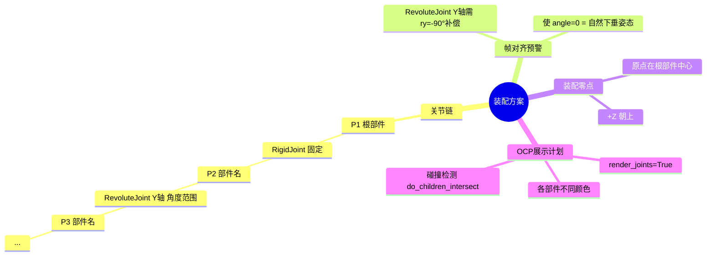
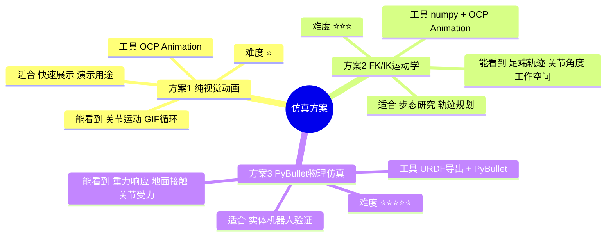

# 多部件流程 Playbook（Multi-Part Protocol）

> **何时进入此 Playbook**：用户需求含 ≥2 个部件 / 关节装配 / 仿真需求。
> 入口由 `SKILL.md` 的"流程路由"表触发。

---

## 执行契约（进入此 Playbook 后对本次对话强制生效）

1. 进入本 Playbook 前必须先确认场景为"多部件 / 仿真 / 装配"；若只是单部件，回到 `single-part-playbook.md`。
2. Phase 必须按 P1 → P2 → P3 → P4 顺序执行，**跳阶视为违规**；产出报告里每一条必须是 `[x]`（已产出）或 `[skip] reason=...`（显式跳过）。
3. 每个 Phase 完成后必须在当次回复里输出"产出报告"块，**不得跳过回报直接进下一 Phase**。没写产出报告的 Phase 视为未完成。
4. P1 / P2 末尾必须有用户确认门（✋），未确认不得前进；P3 / P4 的确认门按本 Playbook 具体段落执行。
5. P3 装配完成后必须触发 OCP 预览（`show(..., render_joints=True)`），符合 SKILL.md 角色规则 #5「建模即预览」。
6. （保留位）本流程暂不涉及经验缓存（`experience/`）交互；参考物型装配如需经验写读，请并入 `reference-product-playbook.md` 第 6 条。此条号保留以对齐其他 Playbook。
7. 每个 Phase 产出报告第一行必须是 Quote-back，格式：
   引自 multi-part-playbook.md §Phase P<n> / <小标题>："<原文一行>"
   缺 Quote-back、引错 Phase、原文与文件不符 = 违规，必须回补 Read + 重出产出报告。
8. **每个确认门必须遵守 SKILL.md §确认门执行契约**（halt 前三项自检 + `[halt-for-user]` 硬字段 + 同轮不得推进）；违规 = FM-13。

---

## P1~P4 Phase 总表

| Phase | 本步产出 | 允许跳过？ | 下一步 |
|---|---|---|---|
| P1 需求拆解 + 专家咨询 | 需求拆解报告 + 确认门 ✋ | 否 | → P2 |
| P2 部件级建模（每部件 3 变体） | 每部件 3 变体 + 用户选定 + **Step 2e：整机 `assembly_contract.yaml` + `precheck_bbox.md` + 用户确认门 ✋** | 否 | → P3 |
| P3 装配 / 关节 | `<asm>.py` + Joint 方案（mindmap 先讨论）+ OCP 预览（`render_joints=True`）+ 碰撞检测 + 爆炸动画 + **`joint_to_crossref.md` 映射表** | 否 | → P4 |
| P4 导出 + Layer 1/2 验证 | `<asm>.step`/`.stl` + Layer 1 几何验证 + **Step 4.3 整机 Stage C 跑 cross_refs** + （可选）Layer 2 装配体视觉验证 | Layer 2 可在"非参考物型装配"时 `[skip]` | （终态） |

---

## Phase P1: 需求拆解 + 专家咨询

**前置**：
- [x] 用户需求进入，SKILL.md 路由判定为多部件 / 装配 / 仿真
- [x] AI 在开口拆解前已问过用户"是否有参考图、参考链接或详细描述"

**本步产出**：
- 需求拆解报告（部件清单 + 装配关系 + 工艺确认 + 仿真需求 + 可选专家意见）
- 形态评估结论（命中的形态主观词列举 + P2 路径判定：走方案 F / 走方案 A）
- 用户确认门 ✋

**命令模板**：

Phase 1 开始前必须询问：

```
在开始拆解之前，请问你是否有参考图、参考链接或详细描述？
（有的话发给我，我会用「参考图标注」方案 D 解读后再拆解部件）
```

收到需求（+ 可选参考图）后输出以下结构，等用户确认：

```
## 需求拆解报告

### 部件清单
| 编号 | 名称 | 功能 | 对应参考图区域 |
|------|------|------|----------------|
| P1   | ...  | ...  | 图中xxx区域     |

### 装配关系
P1 → RigidJoint → P2 → RevoluteJoint(Y轴, ±45°) → P3 → ...

### 工艺确认
目标工艺：[ ] 3D打印  [ ] CNC铝板  [ ] 激光切割  [ ] 其他
AI推荐：___（附理由）

### 仿真需求
[ ] 无需仿真  [ ] OCP动画  [ ] FK/IK运动学  [ ] PyBullet物理仿真

### 专家意见（仅当建模简化 vs 仿真精度有分歧时展示）
Dave Cowden 角度：___
Peter Corke 角度：___
取舍建议：___
```

**几何对齐（Phase 1~2 均可触发）**：用户说出触发词时，执行 `single-part-playbook.md` §Step S2 的 5 种方案。Phase 1 推荐三连组合：
- 方案 D（参考图标注）— AI 纯文字解读参考图，让用户纠错
- 方案 B（OCP 占位块）— 用 `Box`/`Cylinder` 代替真实部件展示整体比例
- 方案 E（参数表）— 建模前列出关键参数，用户逐行确认

AI 不主动触发，必须用户开口要求。

**形态评估**（决定 P2 分支：方案 F vs 方案 A）

检测需求文本（整机及各部件描述）是否含形态主观词（完整词表见 SKILL.md §方案 F：AIGC 概念图 → 参数化设计图 / 触发词）：

- 视觉风格类：科技感、极简、工业风、复古、仿 XX 风格、高级感
- 形态特征类：流畅、仿生、异形、流线型、有机、雕塑感、灵动、柔和曲面
- 产品门类类：潮玩、角品、ID 产品、手办、艺术摆件、概念设计

**任一词命中**（整机或任一部件）→ P2 走方案 F（AIGC 整机 / 关键外观部件概念图 → Gate F1 选图 → 视觉解读 → 3 视图 + 参数合同表 → Gate F2 确认 → 建模）
**未命中** → P2 走方案 A（AI 自画 3 视图 ASCII，沿原流程）

**引 SKILL.md §方案 F / 触发词**：任一主观词命中 → 走方案 F；未命中走方案 A。

> 发 `[halt-for-user]` 前必过 SKILL.md §确认门执行契约 的三项自检。

**确认门 ✋** 用户回复「OK」或修改部件清单后，才进入 Phase P2。

**AI 回报契约**（完成后必须在回复里输出）：

```
Phase P1 产出报告
引自 multi-part-playbook.md §Phase P1 / 本步产出：
  "需求拆解报告（部件清单 + 装配关系 + 工艺确认 + 仿真需求 + 可选专家意见）"
- [x] 需求拆解报告已输出（部件清单 3 项 / 装配链 2 个关节 / 工艺=3D打印）
- [x] 已询问参考图（用户提供 1 张正视图）
- [x] 形态评估结论：<命中词列举 或"未命中">，P2 走 <方案 F / 方案 A>
- [halt-for-user] ✋ 确认部件清单和装配关系正确，回 "OK" 进 P2 / 或指出修改项
下一步：等用户确认 → Phase P2
```

---

## Phase P2: 部件级建模（每部件 3 变体对比）

**前置**：
- [x] P1 需求拆解报告已经用户确认

**本步产出**：
- 对每个部件 Pn 执行完整 4 步循环（Step 2a → 2b → 2c → 2d），全部通过才进入下一部件：
  - Step 2a：3 个变体（V1 保守 / V2 参考 / V3 加强）并排展示
  - Step 2b：AI 自动比对分析（变体对比表 + 推荐）
  - Step 2c：自动断言（BRep 有效 / 体积合理 / STEP 精度）
  - Step 2d：用户选定变体，导出 STEP 存档
- 全部部件走完后统一汇总，等用户确认再进 P3

**命令模板**：

### Step 2a — 建 3 个变体并排展示

```python
# 三变体并排（X方向偏移，OCP同一窗口对比）
# V1 保守：尺寸偏小/偏薄，适合轻量化
# V2 参考：最贴合参考图，标准工艺（推荐）
# V3 加强：关键截面加宽，承载需求高
offset = part_width * 1.5
v1 = make_variant_1(...)
v2 = make_variant_2(...).move(Location((offset, 0, 0)))
v3 = make_variant_3(...).move(Location((offset*2, 0, 0)))
show(v1, v2, v3,
     names=["V1_conservative", "V2_reference", "V3_reinforced"],
     colors=["steelblue", "orange", "green"],
     reset_camera=Camera.ISO)
```

### Step 2b — AI 自动比对分析（必须输出）

```
## 部件 Pn「name」变体对比

| 变体 | 对应参考图位置 | 尺寸符合度 | 建模特点       | 推荐工艺 |
|------|--------------|-----------|----------------|---------|
| V1   | 图中xxx区域   | ~85%      | 轻量，腰部偏细  | 3D打印  |
| V2   | 图中xxx区域   | ~97%      | 标准CNC截面    | CNC     |
| V3   | 图中xxx区域   | ~80%      | 端部加宽，略重  | CNC     |

推荐：V2（最贴合参考图，符合已确认工艺）
```

### Step 2c — 自动断言（三项全过才可选，任一失败标红不可选）

```python
assert part.is_valid(),                        "BRep 无效"
assert lower_bound < part.volume < upper_bound, "体积超范围"
export_step(part, step_path); reimported = import_step(step_path)
assert abs(reimported.volume - part.volume) / part.volume < 0.001, "STEP精度损失"
```

输出格式：
```
V1: ✅ BRep有效  ✅ 体积合理  ✅ STEP精度  → 可选
V2: ✅ BRep有效  ✅ 体积合理  ✅ STEP精度  → 可选（推荐）
V3: ✅ BRep有效  ❌ 体积过大(偏差>20%)    → 不可选
```

> 发 `[halt-for-user]` 前必过 SKILL.md §确认门执行契约 的三项自检。

### Step 2d — 确认门 ✋

```
请选择 Pn 的变体：[ V1 ] [ V2（推荐）] 或告诉我需要调整的参数
选定后导出 STEP 存档，进入 P(n+1)「下一部件」建模
```

**AI 回报契约**：

```
Phase P2 产出报告
引自 multi-part-playbook.md §Phase P2 / 本步产出：
  "每部件 3 变体（V1/V2/V3）+ OCP 并排对比 + 自动断言 + 用户选定"
- [x] part_A_v1.py / part_A_v2.py / part_A_v3.py   (断言全过，用户选 V2)
- [x] part_B_v1.py / part_B_v2.py / part_B_v3.py   (V3 体积超标，用户选 V1)
- [x] tests/<test>/exports/part_A_v2.step           (选定版本 STEP 存档)
- [x] tests/<test>/exports/part_B_v1.step
- [halt-for-user] ✋ 全部部件已选定，回 "OK" 进 Step 2e 汇总 / 或调整变体
下一步：Step 2e 整机合同化 + bbox 预检
```

> 发 `[halt-for-user]` 前必过 SKILL.md §确认门执行契约 的三项自检。

### Step 2e — 整机合同化 + bbox 预检 + 用户确认门 ✋

**前置**：Step 2a~2d 所有部件各自选定变体并导出 STEP。

**本步产出**：
- `tests/<test>/assembly_contract.yaml`（含顶层 `parts` + `cross_refs`，schema 见 `references/verify/layer0-contract.md §Appendix B`）
- `tests/<test>/precheck_bbox.md`（两两 AABB 重叠检查）
- 用户 review 两份产物后决定 "ok 进 P3" 或 "改 <具体>"（未确认前不得进 P3）

#### Step 2e.a — 汇总 `assembly_contract.yaml`

**输入**：每个部件最终变体的 `<part>.py`（取 bbox + 关键参数）+ P1 需求拆解报告里的"部件间关系"段。

**产出骨架**（扩展 layer0-contract schema，所有新增字段顶层可选）：

```yaml
version: "1.0"
meta:
  name: <asm_name>
  source: multi-part-playbook P2 Step 2e
  date: 2026-04-18

globals:
  unit: mm

parts:                               # 顶层可选数组，多部件必填
  - slug: arm
    file: arm.py
    bbox: {x: 80, y: 20, z: 8}       # 最终变体的 bbox（粗估 OK）
    placement:
      anchor: "底座 servo horn 中心"
      offset: [0, 0, 6]
  - slug: horn
    file: horn.py
    bbox: {x: 20, y: 20, z: 5}
    placement:
      anchor: "servo 轴"
      offset: [0, 0, 0]

cross_refs:                          # 顶层可选数组，多部件硬下限 ≥1
  - id: arm_above_horn
    type: ordering
    parts: [arm, horn]
    axis: z
    direction: "arm > horn"
    tolerance: 0.5
  - id: axle_center_match
    type: concentric
    parts: [arm, horn]
    feature: "axle_hole"
    tolerance: 0.1

features: []                         # 多部件整机合同可空
param_map: {}
variants: []                         # 整机不做变体
```

**规则**：
- `parts` 每条对应一个 `<part>.py`
- `cross_refs.type` 限定 Stage C 已支持的 6 种：`inter_dist` / `ordering` / `colinear` / `same_face` / `symmetric_pair` / `concentric`
- `cross_refs` 条数 ≥ P1 拆解报告列的装配关系数（不得漏条，漏条 = FM-12）
- 硬下限：**≥1 条**（零跨部件关系 = 不该走多部件流程）

#### Step 2e.b — bbox 预检

**算法**：AABB 重叠，对 `parts` 节每对 (i, j) 按三轴检查：

```
三轴重叠 = (bbox_i.x + bbox_j.x)/2 > |placement_i.offset.x - placement_j.offset.x|
         AND 同理 y AND 同理 z
```

- 任一轴不重叠 → ✅ 无碰撞风险
- 三轴都重叠 → ⚠ 疑似碰撞（不阻断，只标注）

**产出** `precheck_bbox.md` 模板：

```markdown
# P2 bbox 预检（简化 AABB）

配对数：N
疑似碰撞：K

## arm ↔ horn
- placement 距离：(0, 0, 6)
- 三轴重叠：x ✓  y ✓  z ✗
- 结论：✅ 无碰撞风险

## horn ↔ base
- placement 距离：(0, 0, 8)
- 三轴重叠：x ✓  y ✓  z ✓
- 结论：⚠ 疑似碰撞，P3 装配时检查是否 horn 应埋进 base
```

**疑似碰撞不阻断**——标注即可。P3 装配后由 `do_children_intersect()` 做权威判定；FM-11 要求 P3 `joint_to_crossref.md` 回应每条 ⚠。

> 本 Step 2e.c 的硬自检等价于 SKILL.md §确认门执行契约 的三项自检，此处更细化为 Step 2e.c 专属（parts/cross_refs/type 静态检查）。

#### Step 2e.c — 用户确认门 ✋

**发出确认门前的硬自检**（任一未过，**直接回 Step 2e.a 修复，不得进 ✋、不等用户指出**）：

- [ ] `parts.length ≥ 2`（少于 2 回 single-part-playbook）
- [ ] `cross_refs.length ≥ 1`（零跨部件关系 ≠ 多部件场景）
- [ ] `cross_refs.length ≥ P1 拆解装配关系数`（不齐 → 主动触发 **FM-12** 回 2e.a 逐条补齐）
- [ ] 每条 `cross_refs.type ∈ {inter_dist, ordering, colinear, same_face, symmetric_pair, concentric}`（不合法 → 回 2e.a 改 type）

FM-12 必须由 AI **主动**触发，用户提示才发现 = 漏自检。

**AI 回报契约**：

```
Step 2e 产出报告
引自 multi-part-playbook.md §Phase P2 / Step 2e：
  "Step 2e 末尾必须等用户确认 assembly_contract.yaml 和 precheck_bbox.md"
- [x] tests/<test>/assembly_contract.yaml（parts: N，cross_refs: M）
- [x] tests/<test>/precheck_bbox.md（疑似碰撞 K 处）
- [x] 自检：parts N≥2 ✓ | cross_refs M≥1 ✓ | M≥P1 装配关系 K ✓ | types 全合法 ✓
请 review 两份产物，回：
  - "ok 进 P3"：继续装配
  - "改 <具体>"：回 P2 对应 Step 调整

[halt-for-user] ✋ review assembly_contract.yaml + precheck_bbox.md，回 "ok 进 P3" 或 "改 <具体>"
```

---

## Phase P3: 装配 / 关节

**前置**：
- [x] P2 所有部件已各自选定变体并导出 STEP
- [x] `tests/<test>/assembly_contract.yaml` 已通过 Step 2e 用户确认门（内含 cross_refs）

**本步产出**：
- 装配方案脑图（Mermaid mindmap，先讨论不写代码）
- `<asm>.py`（装配脚本）
- Joint 方案（RigidJoint / RevoluteJoint / FixedJoint 等 + 帧对齐补偿）
- OCP 装配预览触发（`render_joints=True`）
- 碰撞检测（`do_children_intersect()`）
- `tests/<test>/joint_to_crossref.md`（Joint 与 `assembly_contract.cross_refs` 对齐映射表）
- 爆炸动画（可选，便于用户直观看到装配关系）

**cross_refs 对齐规则**：P3 装配设计 Joint 时，先 Read `assembly_contract.yaml` 的 `cross_refs` 节。每条 cross_ref 对应一个装配约束目标，Joint 方案需对齐：

| cross_ref.type | Joint 实现方向 |
|---|---|
| `concentric` | `RigidJoint.concentric(part_a.hole, part_b.axle)` 或同轴 `RevoluteJoint` |
| `inter_dist(d)` | `RigidJoint` offset 包含该距离，或 `LinearJoint` 行程覆盖 |
| `ordering(axis, dir)` | Joint 装配后沿 axis 的先后顺序与 direction 一致 |
| `colinear` | 两部件特征法向沿同轴（`Location` 姿态对齐） |
| `same_face` | `RigidJoint` 贴合同一平面（offset 沿法向=0） |
| `symmetric_pair` | 成对 Joint 关于平面镜像 |

**命令模板**：

### Step 3a — 装配方案脑图（先讨论，不写装配代码）

用 Mermaid mindmap 展示部件关系，用户一眼看清层级和关节类型：

````markdown

````

> 发 `[halt-for-user]` 前必过 SKILL.md §确认门执行契约 的三项自检。

**确认门 ✋** 用户看脑图后回复「OK」或指出修改节点，才写装配代码执行。

[halt-for-user] ✋ 确认装配脑图关节链 + 帧对齐方案正确，回 "OK" 进 Step 3b 装配代码 / 或指出修改节点

### Step 3b — 装配执行

生成关节代码 → 运行 → `show(..., render_joints=True)` → `do_children_intersect()` → STEP 导出。

**帧对齐强制规则**（test 11 实战验证）：`RevoluteJoint` Y 轴时必须加 `joint_location=Location((0,0,0),(0,-90,0))`，验证：
```python
assert part.bounding_box().min.Z < -part_h * 0.8
```

### Step 3c — （可选）仿真规划（3 方案）

若 P1 "仿真需求" 勾选了 OCP 动画 / FK-IK / PyBullet，Phase P3 末尾加选方案脑图 + 专家建议：

````markdown

````

Peter Corke 专家建议（面向非专业用户）：

```
「先走路再跑步——从方案1开始，能让你在10分钟内看到腿动起来。
 方案2适合你想研究「腿怎么走才不摔」的阶段。
 方案3只在你真的要做实体机器人时才需要。」

请选择：
[ ] 方案1 — 我只需要看动画效果
[ ] 方案2 — 我想研究步态和轨迹（推荐）
[ ] 方案3 — 我要做实体机器人
[ ] 方案1+2 — 先做动画，再加运动学
```

> 发 `[halt-for-user]` 前必过 SKILL.md §确认门执行契约 的三项自检。

**确认门 ✋** 用户选择后，AI 说明该方案具体实现步骤（DH参数表 / 步态相位表 / URDF 计划），再次确认才生成仿真代码。

[halt-for-user] ✋ 选方案编号（1/2/3/1+2），或回 "无需仿真"

**AI 回报契约**：

```
Phase P3 产出报告
引自 multi-part-playbook.md §Phase P3 / 本步产出：
  "<asm>.py + Joint 方案（mindmap 先讨论）+ OCP 预览（render_joints=True）+ 碰撞检测 + 爆炸动画"
- [x] 装配脑图已输出（用户确认方案）
- [x] tests/<test>/<asm>.py                      (RigidJoint ×1 + RevoluteJoint ×2)
- [x] OCP 装配预览已打开（端口 3939，render_joints=True）
- [x] do_children_intersect() = False            (无碰撞)
- [x] tests/<test>/joint_to_crossref.md          (Joint 方案覆盖 cross_refs 全部 N 条)
- [skip] 爆炸动画                                (reason: 仅 3 部件，装配关系已直观可见)
- [skip] Step 3c 仿真规划                        (reason: P1 勾选"无需仿真")
下一步：Phase P4

**`joint_to_crossref.md` 模板**（简单映射表，非严格 schema）：

```markdown
| cross_ref.id | Joint 实现 |
|---|---|
| arm_above_horn | RigidJoint(arm, offset=Location((0,0,6))) |
| axle_center_match | RigidJoint.concentric(arm.hole, horn.axle) |
```
```

---

## Phase P4: 导出 + Layer 1/2 验证

**前置**：
- [x] P3 装配完成且 OCP 预览通过、无碰撞

**本步产出**：
- `<asm>.step`（装配体 STEP 导出，主流 CAD 通用格式）
- `<asm>.stl`（可选，3D 打印用）
- Layer 1 几何验证通过（装配体 BRep 有效 / 体积合理 / STEP 精度回读）
- （可选）Layer 2 装配体视觉验证（仅参考物型装配；非参考物型可 `[skip]`）

**命令模板**：

### Step 4a — 装配体导出

```python
from build123d import export_step, export_stl

export_step(assembly.compound(), f"tests/<test>/<asm>.step")
# 3D 打印场景另导 STL
export_stl(assembly.compound(), f"tests/<test>/<asm>.stl", tolerance=0.05)
```

### Step 4b — Layer 1 几何验证（装配体）

```python
asm_compound = assembly.compound()
assert asm_compound.is_valid(),                        "装配体 BRep 无效"
assert asm_total_lower < asm_compound.volume < asm_total_upper, "装配体总体积超范围"

# STEP 回读精度
reimported = import_step(f"tests/<test>/<asm>.step")
diff = abs(reimported.volume - asm_compound.volume) / asm_compound.volume
assert diff < 0.001, f"STEP 精度损失 {diff:.3%}"
```

### Step 4.3 — 整机 Stage C 验证（对装配体跑 cross_refs）

对装配体运行 `assembly_contract.cross_refs`，Stage C 执行器已支持全部 6 种类型（`inter_dist` / `ordering` / `colinear` / `same_face` / `symmetric_pair` / `concentric`）。

- **输入**：装配体（Compound）+ `tests/<test>/assembly_contract.yaml`
- **执行**：对每条 cross_ref 提取对应 part 的 face/edge/point，按 type 跑 Stage C
- **输出**：`tests/<test>/output/stage_c_assembly.md`（PASS/FAIL per cross_ref）

**硬规则**：
- 任一 cross_ref FAIL → P4 不通过，回 P3 调 Joint 或回 Step 2e 调 cross_refs
- `do_children_intersect()` 仍保留（几何侵入是 Stage A/B 层，cross_refs 是语义约束层，互补不替代）

### Step 4c — （可选）Layer 2 视觉验证

仅当装配体为"已知产品/已知参考图"（即走参考物 Playbook 路径）时执行：

```bash
SKILL=/Users/liyijiang/.agents/skills/build123d-cad

python3 $SKILL/scripts/visual/multi_view_screenshot.py \
  tests/<test>/<asm>.step \
  --mode ortho \
  --face-mapping references/<slug>/part_face_mapping.yaml

python3 $SKILL/scripts/visual/visual_compare.py \
  output/<asm>_FRONT.png references/<slug>/clean/official_front_cropped.png \
  --reference-scale references/<slug>/clean/official_front_scale.json \
  --rendered-scale auto \
  --mode edge_overlay \
  --output output/compare_front.png
```

**Layer 2 失败反馈**：IoU < 0.85 时按 `references/verify/feedback-diagnosis.md` 分根因回退：
- 根因 A（数据源错）→ 回补 `reference-product-playbook.md` §R2/R3
- 根因 B（合同错）→ 回 `reference-product-playbook.md` §R3.5 改 contract.yaml
- 根因 C（代码错）→ 回 P2 改对应部件，或回 P3 改装配/关节
- 修复上限：L1×3 + L2×2 + 跨层×2 = 总计 ≤ 5 轮

**AI 回报契约**：

```
Phase P4 产出报告
引自 multi-part-playbook.md §Phase P4 / 本步产出：
  "<asm>.step/.stl + Layer 1 几何验证 + （可选）Layer 2 装配体视觉验证"
- [x] tests/<test>/<asm>.step              (总体积 12 430 mm³，回读精度 0.02%)
- [x] tests/<test>/<asm>.stl               (tolerance=0.05)
- [x] Layer 1: BRep 有效 / 体积合理 / STEP 精度 全过
- [x] Step 4.3 整机 Stage C: cross_refs N 条全部 PASS (stage_c_assembly.md)
- [skip] Layer 2 视觉验证                  (reason: 非参考物型装配)
多部件流程 P1~P4 完成。
```

**参考**：
- Layer 1：`references/verify/layer1-verification.md`
- Layer 2：`references/verify/layer2-visual.md` + `references/verify/edge-comparison.md`
- 反馈闭环：`references/verify/feedback-diagnosis.md`

---

## 常见失败模式

跨 Playbook 通用的 Quote-back 违规见 `protocols/README.md`。以下为多部件流程专属：

### FM-10：缺 assembly_contract

**诊断**：P2 末尾没产出 `tests/<test>/assembly_contract.yaml` 就进 P3；或 P3 装配脚本在 Step 2e 用户确认门未通过前已经开始写。

**修复**：回 P2 Step 2e 补齐 `assembly_contract.yaml` + `precheck_bbox.md`，重走确认门 ✋ 后才进 P3。

### FM-11：bbox 预检疑似碰撞未记录

**诊断**：`precheck_bbox.md` 标了 ⚠ 疑似碰撞，但 P3 的 `joint_to_crossref.md` 对该对部件没有回应（既没加 `concentric` / `inter_dist` cross_ref 下限约束，也没在装配后单独跑 `do_children_intersect()` 验证）。

**修复**：P3 装配后针对该对部件跑 `do_children_intersect()`，或在 `assembly_contract.cross_refs` 里补一条对应 `inter_dist` 约束下限，并在 `joint_to_crossref.md` 映射表上明确回应。

### FM-12：cross_refs 覆盖不全

**诊断**：P1 需求拆解报告列的装配关系条数 > `assembly_contract.cross_refs` 条数，存在漏翻译。**应由 AI 在 Step 2e.c 自检清单时主动发现**，用户提示才发现 = 漏自检（自身已是 FM-12 亚型）。

**修复**：回 Step 2e.a 对齐 P1 拆解报告逐条补齐 cross_refs；硬下限 `cross_refs` ≥ 1 条，且 ≥ P1 拆解装配关系数。修复后重跑 Step 2e.c 自检清单 → 通过再发确认门。

### FM-13：越权通过确认门

**诊断**：multi-part-playbook §P1 末尾 / Step 2d / Step 2e.c / Step 3a 脑图 / Step 3c 仿真方案 的确认门要求 `[halt-for-user]`，AI 同一轮回复里发了 halt 又继续推进（给装配代码 / 进下一 Step / 直接写最终产物）。典型诱因：用户说"时间紧""Phase 简化"导致 AI 跳 P1 拆解 halt 或 Step 2e 合同 halt。

**修复**：删除 halt 之后的所有推进内容；保留 halt，重出该轮回报；等用户下一轮真实回执（OK / 修改 / 提问）才决定如何进下一 Step。
